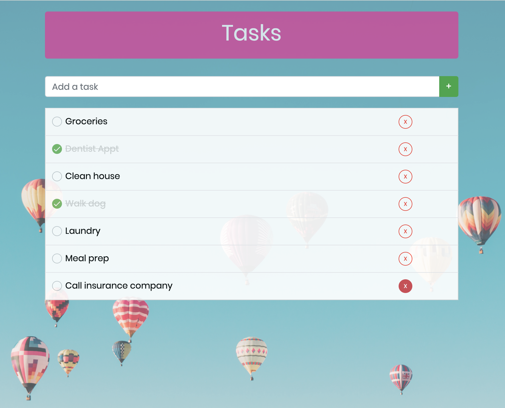

# SQL To-Do List

## Description

This 'TO-DO' application allows a user to create tasks, view all current tasks, mark tasks as completed, and delete tasks. It does this by collecting the new task input value, storing the information in a database, and then accessing the database table to retrieve, add, update and delete tasks.

## Prerequisites
- Node.js

## Screen Shot

## Getting Started
- npm install
- npm start
- Open in browser on PORT 5000

## Usage
1. User enters new task and clicks the '+' button to add the task to the list.
2. User can click the checkbox to mark as task as completed which will cross task out change color to gray.
3. User can delete a task by clicking the 'X' button.

## Built With
- JavaScript
- Node.js
- Express.js
- postgresql
- jQuery
- Bootstrap
- pretty-checkbox

## Acknowledgement
Thank you to Prime Digital Academy for equipping me with the knowledge and tools to create this application.